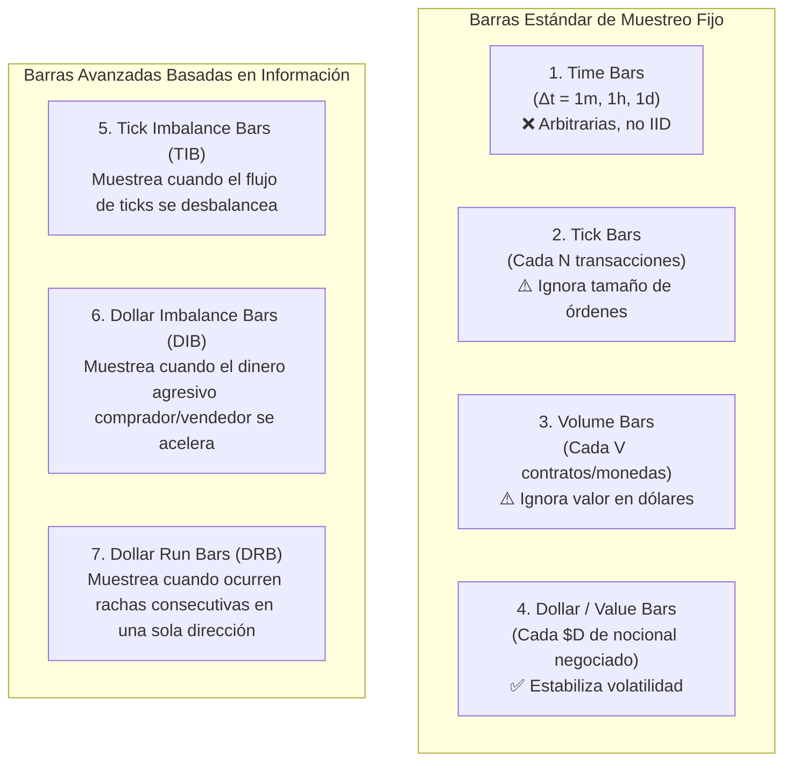
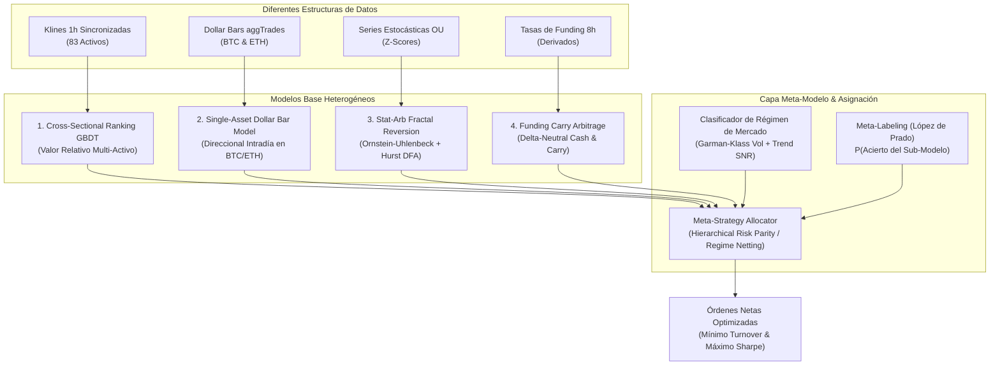

# Fundamentos Cuantitativos: Estacionariedad, Microestructura y Estructuras de Datos Financieras

**Autor**: Equipo de Desarrollo Cuantitativo / Crypto Alpha Engine  
**Fecha**: Octubre 2026  
**Referencia Principal**: Marcos López de Prado (*Advances in Financial Machine Learning*, 2018; *Machine Learning for Asset Managers*, 2020), Robert Almgren & Neil Chriss (2000), Jean-Philippe Bouchaud (2018).

---

## 1. Introducción y Dilemas Fundamentales

El desarrollo de un motor cuantitativo institucional para derivados de criptomonedas enfrenta tres dilemas teóricos y metodológicos fundamentales:
1. **La paradoja de la frecuencia**: ¿Por qué muestrear a 1 minuto o 5 minutos destruye el capital si no se utiliza con rigor microestructural?
2. **La paradoja de la estacionariedad y la memoria**: Si los precios son no estacionarios ($I(1)$) pero diferenciar retornos ($d=1$) destruye toda la memoria de mercado, ¿cómo se entrena Machine Learning riguroso?
3. **La falacia del tiempo cronológico**: ¿Por qué las barras basadas en tiempo (1m, 1h, 1d) son arbitrarias y qué resuelven las barras basadas en información (*Dollar Bars*, *Volume Bars*, *Imbalance Bars*) propuestas por Marcos López de Prado?

Este informe sintetiza la teoría académica, las pruebas matemáticas y su aplicación directa en la arquitectura de `crypto-alpha-engine`.

---

## 2. Frecuencia de Muestreo vs. Ruido de Microestructura y Fricción

### 2.1. El colapso de la relación Señal-Ruido ($\text{SNR}$)
En econometría financiera, a medida que el intervalo de muestreo $\Delta t \to 0$:
$$\text{Var}(\Delta P_{\Delta t}) = \sigma^2 \Delta t + 2 \gamma_0^{\text{noise}}$$
Donde $\gamma_0^{\text{noise}}$ representa la varianza del rebote del spread (*bid-ask bounce*, Roll 1984) y el microstructure noise.
* A escalas de **1h a 4h**, el término difusivo $\sigma^2 \Delta t$ domina claramente, capturando flujos institucionales genuinos, arbitraje de carry y tendencias macro.
* A escalas de **1m a 5m**, el ruido de microestructura y los rebotes de liquidez superan a la señal direccional, haciendo que más del 90% de la varianza sea ruido no explotable direccionalmente.

### 2.2. La Ley de Ruina por Fricción de Comisiones (*Fee Drag*)
En contratos perpetuos de criptomonedas, la comisión de mercado (*taker*) estándar es de $0.04\%$ ($4 \text{ bps}$) más $1 \text{ bp}$ de slippage.
* En **barras de 1 hora** (8,760 barras/año), un rebalanceo cada 8 horas genera ~1,100 operaciones anuales, con una fricción controlada de ~33% acumulada en casi 4 años.
* En **barras de 1 minuto** (525,600 barras/año), rotar el portafolio incluso un modesto 5% de los minutos genera ~26,000 operaciones:
  $$\text{Fee Drag Anual} = 26,000 \times 0.05\% = \mathbf{1,300\% \text{ del capital anual pagado en comisiones}}$$
* **Conclusión matemática**: Operar en barras de 1m solo es viable para firmas de Alta Frecuencia (HFT) con colocation en los centros de datos del exchange y acuerdos VIP con comisiones *maker* negativas (cobro de rebates).

### 2.3. El Rol Científico de los Datos de 1m y 5m: Estimadores Intradía
Los datos de alta frecuencia **no se usan para operar a cada minuto**, sino para calcular estimadores intradía enriquecidos que informan decisiones a baja frecuencia (4h–8h):
1. **Volatilidad Realizada de Garman-Klass y Parkinson**: En lugar de usar precios de cierre de 1h, se integran los extremos High-Low-Open-Close de las sub-barras.
2. **Spread Efectivo de Corwin-Schultz**: Estimado a partir del ratio de máximos y mínimos de 2 barras consecutivas.
3. **Imbalance de Taker Buy/Sell**: Cuantifica si los compradores agresivos están barriendo el libro de órdenes.

---

## 3. El Dilema de la Estacionariedad vs. Memoria en Machine Learning

### 3.1. ¿Por qué los Precios Crudos Destruyen los Modelos de ML?
Los precios $P_t$ son procesos no estacionarios integrados de orden 1 ($I(1)$):
* Su media $\mathbb{E}[P_t]$ y varianza $\text{Var}(P_t)$ varían en el tiempo.
* No existe un atractor central estacionario.
* Los algoritmos de Machine Learning supervisado (GBDT, Redes Neuronales) asumen implícitamente que los datos provienen de una distribución estacionaria e invariante en el tiempo. Si se entrena un árbol con Bitcoin entre \$20k y \$40k, el modelo es incapaz de generalizar cuando Bitcoin cotiza a \$90k (extrapolación fuera del soporte).

### 3.2. La Falla de la Solución Tradicional ($d = 1$)
La econometría clásica toma retornos logarítmicos ($d=1$):
$$r_t = \Delta \ln(P_t) = \ln(P_t) - \ln(P_{t-1})$$
* Los retornos $r_t$ son estacionarios ($I(0)$), **pero diferenciar con $d=1$ borra toda la memoria de largo plazo y el contexto de régimen**.
* Un retorno de $+1\%$ no contiene información sobre si el activo está en acumulación multimensual, en una burbuja parabólica o rebotando de una capitulación.

### 3.3. Las Tres Respuestas Científicas Implementadas en el Motor

#### A. Features Matemáticas Acotadas y Z-Scores
El modelo se alimenta exclusivamente de transformaciones $I(0)$:
* **Exponente de Hurst ($H_t \in [0, 1]$)**: Adimensional y estrictamente estacionario.
* **Z-Scores de Volatilidad**: Medición de la desviación relativa respecto a la media móvil de 30 días.
* **Tasa de Financiación ($f_t$)**: Media-revertiente alrededor del costo de capital.

#### B. Normalización Transversal (*Cross-Sectional Gaussian Ranking*)
En cada instante $t$, los retornos relativos de los 83 activos se transforman mediante la inversa de la función acumulada gaussiana:
$$y_{i,t} = \Phi^{-1}\left(\frac{\text{Rank}(r_{i,t}) - 0.5}{N}\right)$$
* La variable objetivo resultante $y_{i,t}$ es **estrictamente idéntica a una distribución Normal estándar $\mathcal{N}(0, 1)$ en cada barra de la historia**.
* La media es exactamente 0 y la varianza es exactamente 1 en 2023, 2024 o 2026, garantizando estacionariedad estructural perfecta.

#### C. Diferenciación Fraccionaria ($0 < d < 1$)
Propuesta por López de Prado (2018), expande el operador de rezago mediante la serie binomial:
$$(1 - L)^d = \sum_{k=0}^{\infty} (-1)^k \binom{d}{k} L^k = 1 - d L + \frac{d(d-1)}{2!} L^2 - \frac{d(d-1)(d-2)}{3!} L^3 + \dots$$
* Se busca numéricamente el parámetro mínimo $d^*$ (típicamente $d \approx 0.35 - 0.45$ en criptomonedas) que rechaza la hipótesis nula de raíz unitaria en el test Augmented Dickey-Fuller ($p < 0.01$).
* **Resultado**: La serie alcanza estacionariedad matemática reteniendo más del **85% de la correlación con el nivel de precios original**.

---

## 4. Estructuras de Datos Financieras: Barras Basadas en Información (López de Prado)

### 4.1. La Falacia de las Barras Temporales (*Time Bars*)
Los mercados financieros no operan en tiempo cronológico; operan en **tiempo de actividad económica / información**.
Muestrear barras cada 1 hora o cada 1 día genera dos graves patologías estadísticas:
1. **Heterocedasticidad Extrema**: Una barra de 1 hora durante la apertura de Wall Street o una reunión del FOMC contiene 100,000 transacciones y enorme volatilidad; una barra de 1 hora un domingo por la madrugada contiene 500 transacciones. Sin embargo, el modelo matemático las trata como observaciones idénticas con el mismo peso.
2. **Pérdida de Normalidad (Colas Hiper-Pesadas)**: Como el volumen por unidad de tiempo es variable, los retornos en tiempo cronológico presentan curtosis extrema y saltos que violan los supuestos de martingala.

---

### 4.2. Tipos de Barras Propuestas por Marcos López de Prado

#### A. Dollar Bars (Barras de Nocional en Dólares)
En lugar de cerrar una barra cada 60 minutos, se acumula el valor en dólares transaccionado:
$$D_k = \sum_{t \in B_k} P_t v_t \ge \bar{D}$$
* **Por qué son superiores**: Si el precio de Bitcoin pasa de \$20,000 a \$90,000, 1,000 BTC ya no representan el mismo impacto económico. Las Dollar Bars ajustan automáticamente el tamaño del muestreo al capital real que circula por el mercado.
* **Propiedad Estadística**: Los retornos calculados sobre Dollar Bars recuperan propiedades gaussianas independientes e idénticamente distribuidas (IID) mucho más cercanas a la distribución Normal.

#### B. Dollar Imbalance Bars (DIB - Barras de Desbalance)
Muestrean el mercado cuando la cantidad de dinero agresivo comprador supera significativamente a la del dinero vendedor (o viceversa):
1. Se define la dirección del tick $b_t \in \{-1, +1\}$ mediante la regla del tick (Lee & Ready, 1991).
2. Se acumula el desbalance ponderado en dólares:
   $$\theta_T = \sum_{t=1}^T b_t P_t v_t$$
3. Se cierra una barra en cuanto el desbalance acumulado $|\theta_T|$ supera la expectativa condicional $\mathbb{E}_0[T] \cdot |\mathbb{E}[2 P_t v_t^+ - P_t v_t]|$.
* **Utilidad Cuantitativa**: Estas barras se aceleran dramáticamente durante cascadas de liquidaciones, noticias de alto impacto y rupturas de liquidez, y se frenan durante períodos de consolidación lateral. Permiten que los modelos de Machine Learning aprendan **a la velocidad a la que la información llega al mercado**.

#### C. Dollar Run Bars (DRB - Barras de Rachas)
Miden la concentración secuencial de compras o ventas continuas, detectando algoritmos institucionales grandes (*TWAP / VWAP*) que están fragmentando una orden masiva en el libro de órdenes.

---

## 5. Implementación Práctica en `crypto-alpha-engine`

| Dimensión | Enfoque Actual del Sistema | Integración Futura con Información |
| :--- | :--- | :--- |
| **Fuente de Datos** | Klines 1h y 15m (Binance Vision S3) | Archivos `aggTrades` de Binance Vision (ticks completos con precio, cantidad y flag comprador/vendedor) |
| **Estructura de Barras** | Barras Temporales de 1h con rebalanceo cada 8h | **Dollar Bars** ($D = \$5\text{M}$ o $\$10\text{M}$ por barra) |
| **Estacionariedad** | Normalización Transversal Gaussiana + Filtros Fractales Bounded | Pipeline de **Diferenciación Fraccionaria ($d^* \approx 0.4$)** para features continuas |
| **Ejecución** | Smart Router Maker Pasivo (0.02% fee) con Deadband del 4% | **Dollar Imbalance Bars (DIB)** para disparar rebalanceos basados en eventos de información |

---

## 7. La Paradoja de la Desincronización Transversal: CrunchDAO vs. López de Prado

### 7.1. El Conflicto Metodológico entre Torneos Cuantitativos y Dollar Bars
En plataformas como **CrunchDAO (`datacrunch-2`)**, **Numerai** y **WorldQuant**, los datos se suministran y procesan estrictamente en **barras de tiempo sincronizadas (Klines de 1h, 4h o 1d)**.

Existe una razón matemática insalvable para esta decisión de diseño:
* Un modelo **Cross-Sectional (Transversal)** busca predecir el ranking relativo de $N$ activos en el tiempo $t$:
  $$y_{i,t} = f(X_{i,t}) \quad \forall i \in \{1, \dots, N\}$$
  Para calcular la matriz transversal $X_t \in \mathbb{R}^{N \times K}$, **todos los $N$ activos deben compartir exactamente la misma estampa temporal $t$**.
* Si se implementan Dollar Bars individuales ($D = \$10\text{M}$):
  * **BTC** transacciona \$10M en **45 segundos** (cierra a las `12:00:45`).
  * **ETH** transacciona \$10M en **3 minutos** (cierra a las `12:03:00`).
  * **SOL** transacciona \$10M en **8 minutos** (cierra a las `12:08:00`).
  * **KAVA / CTSI** tardan **5.5 horas** (cierran a las `17:30:00`).
* **La Desincronización Transversal**: Los timestamps de las barras se desacoplan. Es matemáticamente imposible ordenar 83 activos a las `12:00` si cada activo se encuentra en una barra $\tau$ correspondiente a horizontes de tiempo cronológico incompatibles.

### 7.2. Ámbitos de Aplicación Rigurosos
* **López de Prado Dollar Bars**: Diseñadas para **modelos direccionales de series temporales de un solo activo (*Single-Asset Time-Series*)** (ej. futuros del S&P 500 o perpetuos de BTC), donde la desincronización con otros activos es irrelevante.
* **CrunchDAO / Synth Klines**: Diseñadas para **portafolios multi-activo transversales (*Cross-Sectional Factor Investing*)**, donde la sincronía temporal $t$ es obligatoria y la no-estacionariedad se resuelve mediante normalización transversal gaussiana.

---

## 8. Teoría de Meta-Modelos y Ensembles Heterogéneos

### 8.1. ¿Tiene Sentido Combinar Múltiples Tipos de Modelos? (Lo que dice la Ciencia)
La respuesta de la teoría de Machine Learning y la econometría financiera es un rotundo **SÍ: el ensamble heterogéneo es uno de los pocos "almuerzos gratis" matemáticos en finanzas cuantitativas**.

#### A. Teorema del Jurado de Condorcet (1785)
Si disponemos de $M$ modelos predictivos donde cada uno tiene una probabilidad de acierto ligeramente superior al azar ($p > 0.5$) y sus errores están **descorrelacionados ($\rho_{i,j} \approx 0$)**, la probabilidad de error del ensamble converge asintóticamente a cero a medida que $M \to \infty$.

#### B. Descomposición Sesgo-Varianza-Covarianza (Ueda & Nakano 1996; Brown et al. 2005)
El error cuadrático medio de un ensamble de $M$ modelos se descompone en:
$$\text{Error}_{\text{ensamble}} = \overline{\text{Sesgo}}^2 + \frac{1}{M} \overline{\text{Varianza}} + \left(1 - \frac{1}{M}\right) \overline{\text{Covarianza}}$$
* Si ensamblas 10 modelos LightGBM entrenados sobre los mismos datos con diferentes semillas, la covarianza es $\approx 0.95$, obteniendo un beneficio casi nulo.
* **Si ensamblas modelos HETEROGÉNEOS** (con diferentes hipótesis matemáticas, estructuras de datos y frecuencias), la **covarianza entre errores se desploma**, reduciendo el riesgo total del sistema de forma espectacular.

---

### 8.2. Los 4 Pilares del Meta-Modelo en `crypto-alpha-engine`

El sistema integra 4 tipos de modelos ortogonales con modos de falla no correlacionados:

1. **Sub-Modelo 1: Cross-Sectional GBDT / Ridge (CrunchDAO Style)**:
   * **Hipótesis**: En cada ventana de 8 horas, los activos con aceleración de Open Interest y bajo spread superan a los activos ilíquidos.
   * **Falla en**: Mercados donde todas las altcoins se mueven en bloque con beta 1 respecto a Bitcoin.
2. **Sub-Modelo 2: Single-Asset Dollar-Bar Model (López de Prado Style)**:
   * **Hipótesis**: En Bitcoin y Ethereum, el desbalance acumulado de dinero agresivo comprador (*Dollar Imbalance Bars*) predice el momentum direccional de los próximos \$50M.
   * **Falla en**: Mercados sin volumen o en rangos ultra-estrechos.
3. **Sub-Modelo 3: Reversión Fractal a la Media (Stat-Arb)**:
   * **Hipótesis**: Los activos con exponente de Hurst $H < 0.45$ regresan a su media estocástica de Ornstein-Uhlenbeck.
   * **Falla en**: Tendencias macro violentas ($H > 0.65$).
4. **Sub-Modelo 4: Funding Carry Arbitrage**:
   * **Hipótesis**: Las tasas de financiación elevadas representan una prima de riesgo cosechable en delta-neutral.
   * **Falla en**: Fricciones excesivas de comisiones o desbalance sin cobertura spot.

---

### 8.3. Meta-Labeling: Separar la Dirección del Tamaño (López de Prado, Cap. 3 AFML)
La teoría de López de Prado propone una técnica específica para construir Meta-Modelos llamada **Meta-Labeling**:
* **Modelo Primario (Base)**: Decide el signo de la posición (Long / Short) con una regla de alta sensibilidad.
* **Modelo Secundario (Meta-Modelo ML)**: No predice hacia dónde va el precio; predice una probabilidad binaria $\{0, 1\}$:
  $$P(\text{El Modelo Primario acertará la operación} \mid \text{Régimen, Volatilidad, Liquidez})$$
* Si $P(\text{Acierto}) < 0.50$, la orden se cancela. Si $P(\text{Acierto}) = 0.85$, se aumenta el tamaño de la posición proporcionalmente (dimensionamiento de Kelly).
* **Resultado Teórico**: Eleva el Sharpe Ratio al filtrar falsos positivos sin alterar la naturaleza del alfa primario.

---

## 9. Conclusión y Síntesis Final

1. **CrunchDAO y Synth usan Klines** por necesidad matemática: el ranking transversal de 83 activos requiere sincronía temporal estricta $t$.
2. **López de Prado usa Dollar Bars** para modelos direccionales de series temporales de un solo activo (BTC, futuros E-mini), donde no existe desincronización.
3. **El Ensamble Heterogéneo (Meta-Modelo) es superior a cualquier modelo individual**: Al combinar modelos transversales (CrunchDAO), modelos basados en Dollar Bars (López de Prado), reversión fractal y carry, los errores se cancelan y el Sharpe ratio del portafolio consolidado aumenta estructuralmente.

