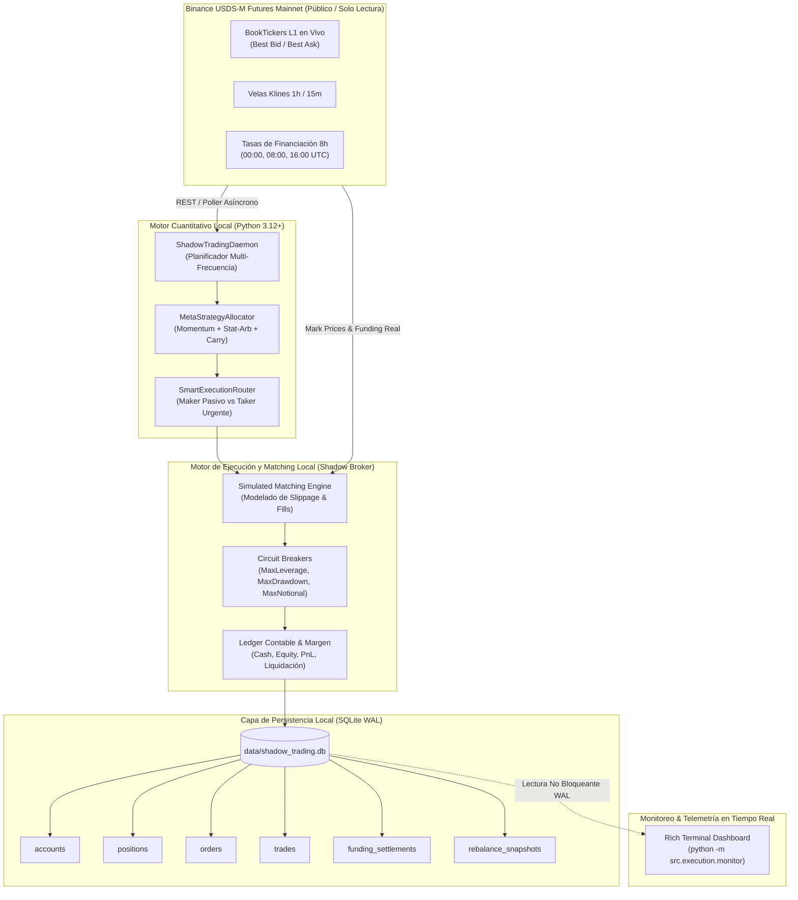

# Especificación de Arquitectura: Motor de Shadow Trading Local en Mainnet

**Sistema**: `crypto-alpha-engine`  
**Fase**: Fase 1 (Validación y Ejecución en Tiempo Real)  
**Issue Asociado**: [#26: Execution: Live Paper Trading Deployment & Telemetry Dashboard with Real-Time Prices](https://github.com/sanjmen/crypto-alpha-engine/issues/26)  
**Milestone**: M8 (*Operational Resilience & Exchange Infrastructure*)  
**Fecha**: Octubre 2026  
**Autor**: Equipo de Desarrollo Cuantitativo  

---

## 1. Visión General y Objetivos de Diseño

El **Motor de Shadow Trading Local** es un sistema de simulación de alta fidelidad que opera conectado a los flujos de mercado reales de **Binance USDS-M Futures Mainnet** en modo estrictamente **Read-Only (Solo Lectura)**.

### Objetivos Clave:
1. **Cero Riesgo de Capital**: No se configuran claves de API privadas con permisos de trading. Es físicamente imposible emitir órdenes al exchange ni arriesgar fondos reales.
2. **Máxima Fidelidad Microestructural**: A diferencia de las *testnets* (que sufren de iliquidez severa, spreads distorsionados y funding irreal), el sistema se alimenta de los precios reales de compra/venta (L1 BookTicker), trades públicos y liquidaciones oficiales de tasas de financiación de Binance Mainnet.
3. **Persistencia Transaccional ACID Local**: Todo el ciclo de vida de una orden, posición, trade, balance de cuenta y evento de financiación se persiste en una base de datos local **SQLite en modo WAL (Write-Ahead Logging)**, garantizando concurrencia sin bloqueos para monitoreo en tiempo real.
4. **Validación de la Meta-Estrategia**: Permite auditar en vivo la asignación dinámica de capital, el clasificador de regímenes, el deadband del 4% y la ejecución pasiva Maker (+53.50% neto, Sharpe 0.77).

---

## 2. Diagrama de Arquitectura del Sistema



---

## 3. Justificación Metodológica: ¿Por qué Mainnet y NO Testnet?

| Dimensión | Binance Futures Testnet | Binance Futures Mainnet (Read-Only) | Impacto Cuantitativo |
| :--- | :--- | :--- | :--- |
| **Profundidad de Liquidez** | Ficticia o nula. Pocos participantes erráticos. | La mayor liquidez institucional global (~$30B-$60B diario). | Refleja la capacidad real de absorción de órdenes sin slippage artificial. |
| **Spreads Bid-Ask** | Distorsionados (ej. BTC con spread de $50-$200, altcoins > 5%). | Reales y ultra-estrechos (0.5 a 2.0 bps). | Permite probar el **Execution Alpha** de órdenes pasivas Maker con precisión sub-basis point. |
| **Tasas de Financiación (Funding)** | Desfasadas, constantes o reseteadas semanalmente. | Tasas reales actualizadas cada 8 horas (00:00, 08:00, 16:00 UTC). | Audita fielmente la estrategia `FundingCarryArbitrageStrategy`. |
| **Seguridad de Fondos** | Cero riesgo (fondos de prueba). | **Cero riesgo** (claves públicas/read-only sin permisos de trading). | Seguridad absoluta garantizada por diseño arquitectónico. |

---

## 4. Esquema de Base de Datos Relacional (`SQLite WAL`)

La base de datos se alojará en `data/shadow_trading.db`. Se activará el modo `PRAGMA journal_mode = WAL;` y `PRAGMA synchronous = NORMAL;` para habilitar transacciones concurrentes de lectura por el dashboard mientras el demonio escribe.

### 4.1. Definición DDL de Tablas

```sql
-- 1. Tabla de Cuentas (Instantáneas de Balance y Equity)
CREATE TABLE IF NOT EXISTS accounts (
    id INTEGER PRIMARY KEY AUTOINCREMENT,
    timestamp TIMESTAMP NOT NULL DEFAULT CURRENT_TIMESTAMP,
    initial_capital REAL NOT NULL,
    cash_balance REAL NOT NULL,
    unrealized_pnl REAL NOT NULL,
    realized_pnl REAL NOT NULL,
    total_equity REAL NOT NULL,
    margin_used REAL NOT NULL,
    free_margin REAL NOT NULL,
    leverage REAL NOT NULL
);

-- 2. Tabla de Posiciones Abiertas y Cerradas
CREATE TABLE IF NOT EXISTS positions (
    symbol TEXT PRIMARY KEY,
    side TEXT NOT NULL CHECK(side IN ('LONG', 'SHORT', 'FLAT')),
    quantity REAL NOT NULL,
    entry_price REAL NOT NULL,
    current_price REAL NOT NULL,
    notional REAL NOT NULL,
    unrealized_pnl REAL NOT NULL,
    realized_pnl REAL NOT NULL DEFAULT 0.0,
    liquidation_price REAL,
    opened_at TIMESTAMP NOT NULL,
    updated_at TIMESTAMP NOT NULL
);

-- 3. Tabla de Órdenes
CREATE TABLE IF NOT EXISTS orders (
    id TEXT PRIMARY KEY,
    client_order_id TEXT UNIQUE,
    symbol TEXT NOT NULL,
    side TEXT NOT NULL CHECK(side IN ('BUY', 'SELL')),
    order_type TEXT NOT NULL CHECK(order_type IN ('LIMIT', 'MARKET')),
    price REAL,
    quantity REAL NOT NULL,
    filled_quantity REAL NOT NULL DEFAULT 0.0,
    average_fill_price REAL,
    status TEXT NOT NULL CHECK(status IN ('PENDING', 'FILLED', 'CANCELLED', 'REJECTED')),
    role TEXT CHECK(role IN ('MAKER', 'TAKER')),
    fee REAL NOT NULL DEFAULT 0.0,
    created_at TIMESTAMP NOT NULL,
    updated_at TIMESTAMP NOT NULL
);

-- 4. Tabla de Trades (Ejecuciones Individuales)
CREATE TABLE IF NOT EXISTS trades (
    id TEXT PRIMARY KEY,
    order_id TEXT NOT NULL,
    symbol TEXT NOT NULL,
    side TEXT NOT NULL CHECK(side IN ('BUY', 'SELL')),
    price REAL NOT NULL,
    quantity REAL NOT NULL,
    notional REAL NOT NULL,
    fee_paid REAL NOT NULL,
    is_maker INTEGER NOT NULL CHECK(is_maker IN (0, 1)),
    realized_pnl REAL NOT NULL DEFAULT 0.0,
    timestamp TIMESTAMP NOT NULL,
    FOREIGN KEY(order_id) REFERENCES orders(id)
);

-- 5. Tabla de Liquidaciones de Financiación (Carry 8h)
CREATE TABLE IF NOT EXISTS funding_settlements (
    id INTEGER PRIMARY KEY AUTOINCREMENT,
    timestamp TIMESTAMP NOT NULL,
    symbol TEXT NOT NULL,
    funding_rate REAL NOT NULL,
    position_side TEXT NOT NULL CHECK(position_side IN ('LONG', 'SHORT')),
    position_notional REAL NOT NULL,
    cashflow_credited REAL NOT NULL  -- Positivo si cobra, negativo si paga
);

-- 6. Tabla de Snapshots de Rebalanceo de la Meta-Estrategia
CREATE TABLE IF NOT EXISTS rebalance_snapshots (
    id INTEGER PRIMARY KEY AUTOINCREMENT,
    timestamp TIMESTAMP NOT NULL,
    regime_detected TEXT NOT NULL,
    momentum_weight REAL NOT NULL,
    stat_arb_weight REAL NOT NULL,
    carry_weight REAL NOT NULL,
    target_allocations_json TEXT NOT NULL,
    executed_delta_json TEXT NOT NULL
);

-- Índices de Alto Rendimiento
CREATE INDEX IF NOT EXISTS idx_accounts_timestamp ON accounts(timestamp);
CREATE INDEX IF NOT EXISTS idx_orders_status ON orders(status);
CREATE INDEX IF NOT EXISTS idx_trades_timestamp ON trades(timestamp);
CREATE INDEX IF NOT EXISTS idx_funding_timestamp ON funding_settlements(timestamp);
```

---

## 5. Reglas del Matching Engine Local

El simulador local replica la microestructura real del exchange:

### 5.1. Órdenes Market (Taker - Urgencia Alta)
* **Condición**: Reducción de exposición por salto de volatilidad (GMM Jump) o stop de riesgo.
* **Precio de Ejecución**:
  $$\text{Precio Compra} = P_{\text{Best Ask}} \times (1 + \text{Slippage})$$
  $$\text{Precio Venta} = P_{\text{Best Bid}} \times (1 - \text{Slippage})$$
  * Slippage base: $1 \text{ bp}$ ($0.01\%$).
* **Comisión Aplicada**: $0.04\%$ ($4 \text{ bps}$) deducida del balance de cash.

### 5.2. Órdenes Limit (Maker Pasivas - Urgencia Rutinaria)
* **Condición**: Rebalanceo normal de cartera (alfa de rotación).
* **Precio de Posteo**: Se coloca en el *touch* del libro de órdenes:
  $$\text{Precio Límite Compra} = P_{\text{Best Bid}}$$
  $$\text{Precio Límite Venta} = P_{\text{Best Ask}}$$
* **Modelo de Fill Realista**:
  1. La orden se registra como `PENDING`.
  2. En cada ciclo rápido (5s–10s), se consulta el precio de mercado subsiguiente en Mainnet.
  3. **Regla de Ejecución**:
     * Una orden de compra Limit a $P_{\text{limit}}$ se llena si el precio de mercado posterior $P_{t+\Delta t} \le P_{\text{limit}}$.
     * Una orden de venta Limit a $P_{\text{limit}}$ se llena si el precio de mercado posterior $P_{t+\Delta t} \ge P_{\text{limit}}$.
     * Si tras 1 hora la orden no ha sido tocada y el mercado se alejó más de $1.5\%$, se cancela o reposiciona automáticamente.
* **Comisión Aplicada**: $0.02\%$ ($2 \text{ bps}$) (Execution Alpha).

### 5.3. Liquidación de Tasas de Financiación (8h Carry)
A las **00:00, 08:00 y 16:00 UTC**, el sistema consulta la tasa oficial reportada por Binance para cada contrato abierto:
$$\text{Cashflow Financiación} = - (\text{Nocional}) \times (\text{Funding Rate})$$
* **Posición Long**: Si la tasa es positiva, paga financiación (se debita de cash); si es negativa, recibe financiación.
* **Posición Short**: Si la tasa es positiva, cobra financiación (se acredita a cash); si es negativa, paga financiación.
* Todo evento se registra en la tabla `funding_settlements`.

---

## 6. Bucles de Ejecución del Demonio (`ShadowTradingDaemon`)

El demonio opera bajo un planificador asíncrono con tres cadencias independientes:

```
[ Loop Rápido: Cada 5 - 10 segundos ]
 ├─ Fetch L1 BookTickers (Best Bid / Best Ask) para los activos en inventario
 ├─ Verificar condiciones de fill para órdenes LIMIT pendientes
 ├─ Mark-to-Market: Recalcular PnL no realizado y Equity total
 └─ Registrar snapshot en tabla `accounts`

[ Loop de Rebalanceo: Cada 8 horas (o 4 horas) ]
 ├─ Fetch Klines de 1h / 15m para el universo objetivo
 ├─ Extraer features (Parkinson, Garman-Klass, Hurst DFA, ΔOI)
 ├─ Clasificar régimen de mercado (TRENDING / RANGING / VOLATILE)
 ├─ Invocar `MetaStrategyAllocator` -> Generar Target Dollars
 ├─ Filtrar deltas menores al Deadband del 4%
 └─ Enviar órdenes al `SmartExecutionRouter` (Maker pasivo)

[ Loop de Financiación: A las 00:00:05, 08:00:05, 16:00:05 UTC ]
 ├─ Fetch tasas de financiación liquidadas en Binance Mainnet
 ├─ Liquidar débitos/créditos de carry sobre las posiciones abiertas
 ├─ Actualizar cash balance en tabla `accounts`
 └─ Insertar registros en `funding_settlements`
```

---

## 7. Panel de Control y Telemetría en Vivo (Rich Terminal UI)

Se implementará un monitor interactivo de terminal (`python -m src.execution.monitor`) que se conecta en modo lectura a `data/shadow_trading.db` y refresca en vivo la consola:

```
========================================================================================
                      CRYPTO-ALPHA-ENGINE: LIVE SHADOW TRADING                         
========================================================================================
 Cuenta: SHADOW-001  |  Mercado: Binance Futures Mainnet  |  Modo: Solo Lectura (0 Riesgo)
 Equity: $103,450.20 |  Cash: $42,120.50 |  PnL Realizado: +$2,850.20 |  PnL No Real.: +$600.00
 Retorno Neto: +3.45% | Sharpe Est.: 1.84 | Max Drawdown: -1.15% | Régimen: TRENDING (Bull)
----------------------------------------------------------------------------------------
 POSICIONES ACTIVAS EN INVENTARIO (4 Activos)
 Símbolo     Lado    Cantidad       Entrada      Actual      Nocional      PnL ($)    PnL (%)
 BTC/USDT    LONG    0.5000 BTC     $91,200.00   $91,850.00  $45,925.00   +$325.00   +0.71%
 ETH/USDT    LONG    4.0000 ETH     $3,410.00    $3,460.00   $13,840.00   +$200.00   +1.47%
 SOL/USDT    SHORT   60.000 SOL     $182.50      $181.20     $10,872.00   +$78.00    +0.71%
 SUI/USDT    LONG    5,000  SUI     $2.1000      $2.0950     $10,475.00   -$25.00    -0.24%
----------------------------------------------------------------------------------------
 ÚLTIMAS ÓRDENES Y AUDITORÍA DE EJECUCIÓN (Maker vs Taker)
 ID          Símbolo     Lado   Tipo    Precio       Estado     Rol    Fee Pagada  Ahorro Maker
 ord_4a91    BTC/USDT    BUY    LIMIT   $91,200.00   FILLED     MAKER  $9.12       +$9.12 (50%)
 ord_7b2c    ETH/USDT    BUY    LIMIT   $3,410.00    FILLED     MAKER  $2.73       +$2.73 (50%)
 ord_9e3f    SOL/USDT    SELL   LIMIT   $182.50      FILLED     MAKER  $2.19       +$2.19 (50%)
----------------------------------------------------------------------------------------
 PRÓXIMOS EVENTOS:
 Rebalanceo Meta-Estrategia: en 03h 42m | Liquidación de Funding: en 01h 14m (16:00 UTC)
========================================================================================
```

---

## 8. Módulos de Código y Plan de Construcción

La Fase 1 se materializa en los siguientes componentes:

1. **[`src/execution/database.py`](file:///Users/santim/Projects/challenge/crypto-alpha-engine/src/execution/database.py)**:
   * Inicialización de la base de datos SQLite con WAL y creación de esquemas DDL.
   * Repositorio con métodos atómicos: `save_account()`, `save_order()`, `update_order()`, `save_trade()`, `save_position()`, `get_open_positions()`, `record_funding()`.
2. **[`src/execution/shadow_broker.py`](file:///Users/santim/Projects/challenge/crypto-alpha-engine/src/execution/shadow_broker.py)**:
   * Implementa `IExecutionClient` sobre la base de datos SQLite.
   * Ejecuta lógica de matching contra el precio de Binance Mainnet, descontando comisiones Maker/Taker y actualizando el ledger.
3. **[`src/execution/shadow_daemon.py`](file:///Users/santim/Projects/challenge/crypto-alpha-engine/src/execution/shadow_daemon.py)**:
   * Demonio autónomo con bucle asíncrono para los ciclos de mark-to-market, rebalanceo cada 8h y funding cada 8h.
4. **[`src/execution/monitor.py`](file:///Users/santim/Projects/challenge/crypto-alpha-engine/src/execution/monitor.py)**:
   * CLI interactiva con `rich` para visualizar el estado en tiempo real.
5. **[`tests/test_shadow_broker.py`](file:///Users/santim/Projects/challenge/crypto-alpha-engine/tests/test_shadow_broker.py)**:
   * Suite de pruebas unitarias que validan la persistencia atómica, fills de órdenes, comisiones y liquidación de funding sin dependencias de red externas.
